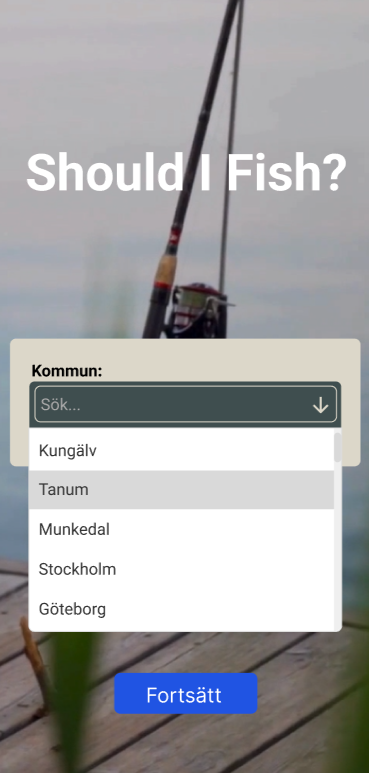

# Should_I_Fish_README

# Idea:
An application providing an index of how good the fishing is for the current day.

# What does it solve:
Collecting and analyzing data from different sources, providing the user with the necessary information all at the same place, aswell as creating a index (Initial scale of index 1-10, 1 = dont bother, 10 = Go fish NOW!).

# Primary data for index:
- SMHI | Air pressure
- SMHI | Water temp (if available)
- SMHI | Wind
- SMHI | Weather
- Time | Time of the day
- Huggtabell | Moon phases

# Starting goal:
- The initial goal is for the user to choose a location and get index and other relevant data for that specific location.
- Maybe implement being able to choose between different types of fish and get an unique index for each fish on the specific day.

# Further implementation
- Adding user for favorite fishing spots
- Users being able to logg successful days
- History analysis - fish caught at index A and not on index B or something like that

# Restrictions
- Only available in Sweden as for now.

# Tech stack
Begin with a web app - later possibly create mobile app

- Frontend: Next.js, Vite, Tailwind, Figma
- Backend: ~~Python Flask~~ Python for calculating index, Redis for caching

# Updates and ideas during development
2025-10-01

I decided to use Figma to create prototypes which will speed up the process of programming the UI. To start I've decided to create two pages (start and main page) 

After reading up on SMHI API and how it works I've decided, for now, to only use a dropdown meny to choose a location from. This is because SMHI has some demands: Keep the API calls to a reasonable amount and cache the data. So I've decided to use a number of predefined geolocations which will be fetched in intervalls of three hours, because that is the API:s update frequency.

The option I'm leaning towards is to fetch all the "kommuner" (290) 

2025-10-02

UPDATE - After some research I've decided to move from Python Flask and instead go with Next.js. This decision was made because when I started creating the prototypes in Figma, I created a starting page and started thinking of how I am going to push data between the two different pages. React does have routes but Next does provide this automatically for you, and in the end I can push the whole project (backend + frontend) as one package. I'm thinking of using Netlify for this. It just overall seems like a more suitible option for this type of project with increased SEO which is always nice but mostly because of faster and easier deployement + server-side rendering (which is really nice for this type of project). I will still use Python for the calculating algoritm.

2025-10-03

Done with the start page, now on to the API / Backend part, before building the UI for the main page. I'm currently thinking of going with a Cache-Aside approach and use Redis as database. 

2025-10-(3-9)

I've created my own API which is used to fetch data from the open source SMHI API. In the API I "clean" the fetched data and saves it into a new object and returns it to the frontend. The API also checks if the date already exists in the redis DB, and if so does return this data instead of a new API fetch. 

The UI design is a iterative process, and as mentioned before I'm using Figma for prototyping which has increased the development speed. I've made the main page into three main sections, Header, Navbar and Main Content (Cards).
The Header shows index of the current hour, together with date-time and location.
The main content section is a carousel of three Cards (Data, Fish and Info). The data card shows all the data for the current day (by the hour), aswell as 10 days forward. Fish Card will contain necessary information about different kinds of fish and, and Info Card will contain information about how the index is calculated. 

I also decided not to use a 1-10 scale for the index and instead use 1-5, since 1-10 is a unnecessarily wide range.  

UPDATE 2025-10-14:

After building a functional python script with mock data and getting it to work, I read up on how to implement it to my next project. After some research I've come to understand that it is actually kind of unecessary to use python for my calculations. I will either have to use child_process which will not work if deployed on vercel/netlify. Or use flask and host the API on something like Railway, which is unecessary since it creates more dependency, potentially increased cost, and complexity. 

I wanted to use python which I've gotten to do and learned a bit about it so it has not been a total waste of time. I will however convert the calculate script to JS, it will be done fast since I already have a working "prototype".

Decided to go with one decimal for the index(e.g. 4.2) instead of a whole number , since it gives and feels lika a more accurate and honest value.

2025-10-15:

Converted the calculate algoritm to JavaScript, and it is working well. I also decided to include a average index value, which is the primary data the user will see. I think it is more valuable to see an average index of the whole day, and also have the option to check specific hours during the day. I decided to make two types of index's, one with Solunar and one without in the calculation, since it is somewhat of a "controversial" metric. So making it on/off option is advantageous. 

To make it as user friendly as possible, I want the user to quickly understand the index and what it means, so I'm thinking of making a info box in the header, if clicked the user will be navigated to the "Info Card". I have already implemented the navigation part. 

I think the majority of backend functionality is finished. Next step is to:
- Finish the UI
- Make it responsive
- On/Off button for solunar values
- Implement robust error handling

2025-10-22:

A lot has happened during the last update. I've finished the UI and restructered it a whole lot. The Card container I made myself worked fine with the y scrolling but did not work well with the x scroll since the cards where different sizes. I found a library called Swiper which fixed the x scroll issues so I implemented it instead. It worked fine on browsers like Chrome and Firefox but did not work at all on Safari. Since Safari is a massive browser it is essential for the site to function on it. Swiper fixed the y scroll issues but not the x scroll. I tried different solutions but nothing worked. I found that if one card differs a lot in y size from the other cards it does not work. Since the card with all the data is the big one, I decided organize all the data into categories, night, morning, afternoon and evening. And only one of the categories can be opened at a time, which actually makes it way more userfriendly. 

I also added new options: with or without solunar and night or day. With these options the user can chose specifically what data to look at. I also added average metrics, so for each day there is a main section showing the average weather data and index for the day/night, with/without solunar. To make this possible I had to add a quite a lot of data my API:
- index with or without solunar
-  night or day index
-  color depending on index and night or day
-  average with or without solunar data
-  average night and day data
etc...

To calculate the average of everything I chose to make a seperate calculation js file for the sake of modularity.

I have set the TTL for Redis cache to 60 minutes, which will reduce the load on the SMHI API aswell as keeping the data up to date.

# Workflow
- Create a basic UI
- Get backend up and running
- Fetch data from API and cache it
- Present the data
- Create index algoritm
- Make calculations
- Present the calculated data + regular data

# Deployement
To be decided:
Netlify or Vercel (Be sure to check so the python script works, if external libraries are installed, include requirements.txt in root)

# Calculating index
My approach is to ask five GenAI (ChatGPT, Gemini, Claude, Perplexity, Grok) to collect reliable data (with sources) about how the different values I'm using (temp, air pressure etc..) affect the fish. I will compare and analyze the answers, and create algoritms accordingly. If 5 of 5 GenAI answers are the same and constructed with relevant sources, they are probably correct and I won't have to compromise. If all the answers differentiate, I will have to look at specific shared and not shared values, and research why they differ. From this I can conclude the data and create the algoritm for the specific value (e.g. temp).

#Figma prototypes
Startscreen prototypes:
|:--:||:--:|
|  |  |

# Diagram
(THIS DIAGRAM IS NOT A TRUE REPRESENTATION OF THE PROJECT)
It was used early just for me to get my thoughts out on how it could/should/might look like

# notes TODO
- Fix Redis DB amount (it can currently store ~200 kommuner) [Maybe by cutting out unnecessary API data] 
- Dokumentera licensvillkor
- Make the app in english
